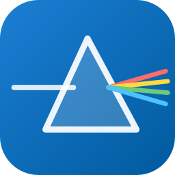
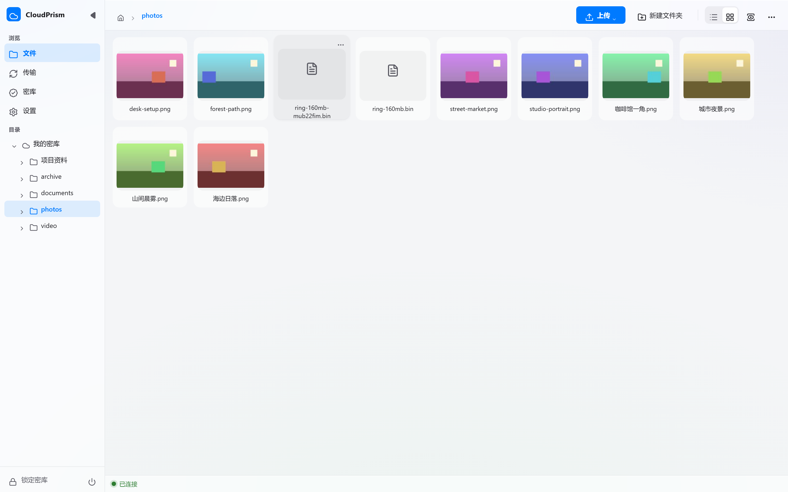
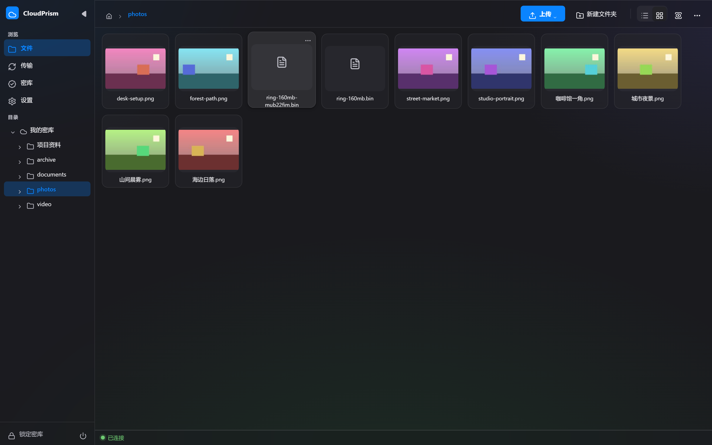

# CloudPrism

[](LICENSE)
[](https://golang.org)
[](https://golang.org)

端到端加密的云盘客户端。文件在本地完成加解密，云端只保存密文——密钥由主密码派生，从不离开本地设备。

<p align="center">
  
</p>

<p align="center">
  
</p>

<details>
<summary>深色主题</summary>

<p align="center">
  
</p>

</details>

## 特性

**文件管理**
- 端到端加密的上传 / 下载，上传即占位、完成即刷新
- 文件夹上传，递归展开并保留原有目录结构
- 拖放上传，文件或文件夹拖入界面任意位置即入队
- 网格 / 列表双视图，多选批量下载、导出、删除
- 右键上下文菜单：打开、下载、重命名、删除、导出到指定目录

**预览与播放**
- 图片即点即显，缩略图服务端重编码并缓存
- txt / Markdown 文本内嵌阅读
- 视频边解密边播放，进度条即时跳转任意位置；卡片自动抽取中心帧作封面并标注时长
- PDF 在浏览器内置阅读器中直读，支持缩放、翻页、搜索与打印
- 音频流式播放；不支持的格式提供「用系统默认程序打开」兜底

**界面**
- 毛玻璃质感：侧栏、页头、底栏、菜单、对话框均为磨砂玻璃，内容滚动时从顶部玻璃页头下方穿过
- 弹性动效：悬停与按压带轻微回弹，页面 / 视图切换、新条目出现均有过渡
- 明暗主题跟随系统或手动切换
- 响应式布局：窄窗口侧栏收为图标条，手机宽度改为底部标签栏

**存储后端**
- 本地文件夹 · WebDAV · 百度网盘（需开放平台应用凭证）

**安全**
- 主密码经 PBKDF2 加随机盐派生密钥，密钥仅驻留内存，退出即清除，不落盘
- 文件 AES-CTR 流式加密，支持从任意位置开始解密
- 文件名加密（建库时可选），开启后远端目录与文件名全部为密文，结构不可见
- 密库元信息 AES-GCM 认证加密，篡改可被发现
- 上传暂存明文在任务结束后回收
- 局域网访问采用令牌闸门，本机免令牌，取不到令牌时回退为仅本机监听
- 日志脱敏，不记录密码与密钥

**便捷**
- 快速重连：记录最近密库，重连只需一次主密码
- 恢复码：用于主密码遗忘时找回访问
- 自动锁定：空闲一段时间后自动锁库
- 局域网访问：同网设备可操作同一密库
- 便携存储：数据存放于程序旁 `data/`，不写注册表与用户目录
- 快捷键：F5 刷新 · Ctrl+U 上传 · Ctrl+D 下载 · Ctrl+L 锁库

## 构建

需要 Go ≥ 1.25。前端产物已入库，纯 Go 构建不需要 Node。

```powershell
cd WindowsGo
$env:CGO_ENABLED = "0"
go build -ldflags "-s -w -H windowsgui" -o build\bin\CloudPrismGo.exe .
```

改动前端源码时需先用 Node ≥ 20 重建产物：

```powershell
npm --prefix frontend run build
```

发布打包用 `WindowsGo/build/release.ps1`，产出 `Release/` 下的便携目录版与单文件版。

## 项目结构

```
CloudPrism/
├── WindowsGo/            # Windows 客户端（纯 Go 单 exe）
│   ├── frontend/         # Vue 3 + Vite + TypeScript 界面
│   ├── build/            # 打包脚本
│   ├── internal/         # 后端业务逻辑
│   ├── pkg/              # 可复用包（协议、流式传输等）
│   └── docs/            # 工程文档
├── Pic/                  # README 资源图
├── Release/              # 发布产物（打包生成）
├── LICENSE
└── README.md
```

## 文档

| 文件 | 内容 |
|---|---|
| `WindowsGo/docs/ARCHITECTURE.md` | 分层原则、目录职责、构建与验证 |
| `WindowsGo/docs/manual_smoke.md` | 手工冒烟清单 |
| `WindowsGo/docs/self_test_guide.md` | 自测指南 |
| `WindowsGo/docs/baidu_guide.md` | 百度网盘开放平台接入步骤 |
| `WindowsGo/interop/README.md` | 密文格式的冻结黄金向量 |

## 已知限制

- exe 没有图标与版本元数据（纯 `go build` 不生成资源段）
- 「检查更新」引擎已实现，界面暂无入口
- 传输速度与缓存占用指标当前不上屏

## 许可证

AGPL-3.0，见 [LICENSE](LICENSE)。
