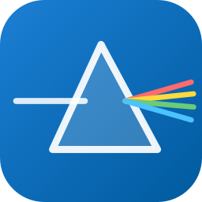
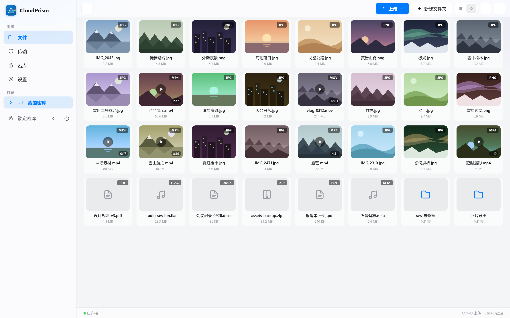
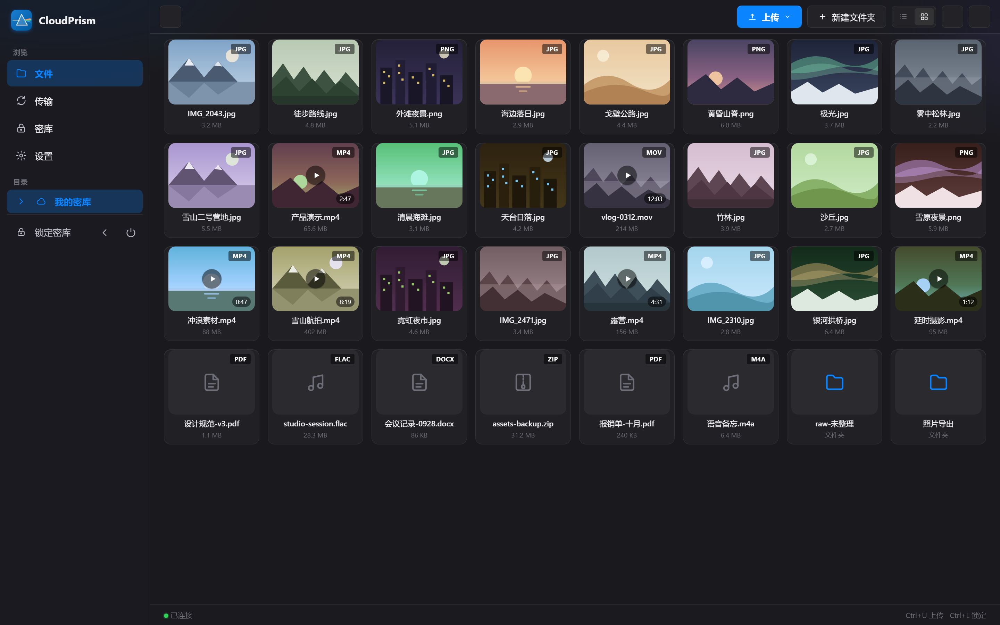

# CloudPrism

[](LICENSE)
[](https://golang.org)
[](https://golang.org)

端到端加密的云盘客户端。文件在本地完成加解密，云端只保存密文——密钥由主密码派生，从不离开本地设备。

<p align="center">
  
</p>

<p align="center">
  
</p>

<details>
<summary>深色主题</summary>

<p align="center">
  
</p>

</details>

## 特性

**文件管理**
- 端到端加密的上传 / 下载，上传即占位、完成即刷新
- 文件夹上传，递归展开并保留原有目录结构
- 拖放上传，文件或文件夹拖入界面任意位置即入队
- 网格 / 列表双视图，多选批量下载、导出、删除
- 右键上下文菜单：打开、下载、重命名、删除、导出到指定目录

**预览与播放**
- 图片即点即显，缩略图服务端重编码并缓存
- txt / Markdown 文本内嵌阅读
- 视频边解密边播放，进度条即时跳转任意位置；卡片自动抽取中心帧作封面并标注时长
- PDF 在浏览器内置阅读器中直读，支持缩放、翻页、搜索与打印
- 音频流式播放；不支持的格式提供「用系统默认程序打开」兜底

**界面**
- 毛玻璃质感：侧栏、页头、底栏、菜单、对话框均为磨砂玻璃，内容滚动时从顶部玻璃页头下方穿过
- 弹性动效：悬停与按压带轻微回弹，页面 / 视图切换、新条目出现均有过渡
- 明暗主题跟随系统或手动切换
- 响应式布局：窄窗口侧栏收为图标条，手机宽度改为底部标签栏

**存储后端**
- 本地文件夹 · WebDAV · 百度网盘（需开放平台应用凭证）

**安全**
- 主密码经 PBKDF2 加随机盐派生密钥，密钥仅驻留内存，退出即清除，不落盘
- 文件 AES-CTR 流式加密，支持从任意位置开始解密
- 文件名加密（建库时可选），开启后远端目录与文件名全部为密文，结构不可见
- 密库元信息 AES-GCM 认证加密，篡改可被发现
- 上传暂存明文在任务结束后回收
- 局域网访问采用令牌闸门，本机免令牌，取不到令牌时回退为仅本机监听
- 日志脱敏，不记录密码与密钥

**便捷**
- 快速重连：记录最近密库，重连只需一次主密码
- 恢复码：用于主密码遗忘时找回访问
- 自动锁定：空闲一段时间后自动锁库
- 局域网访问：同网设备可操作同一密库
- 便携存储：数据存放于程序旁 `data/`，不写注册表与用户目录
- 快捷键：F5 刷新 · Ctrl+U 上传 · Ctrl+D 下载 · Ctrl+L 锁库

## 构建

需要 Go ≥ 1.25。**前端产物不入库**，所以 fresh clone 后必须先构建一次前端
（需要 Node ≥ 20），否则 `go build` 会因 `//go:embed all:frontend/dist`
找不到文件而失败。不想操心顺序就用一键脚本：

```powershell
# 前端 + Go + 组装便携目录 -> releases/<时间戳>/
powershell -ExecutionPolicy Bypass -File scripts\build.ps1
```

只改后端时，可复用本地已有的 `frontend/dist` 跳过 npm 步骤（更快）：

```powershell
powershell -ExecutionPolicy Bypass -File scripts\build.ps1 -SkipFrontend
```

手动分步构建：

```powershell
# 1) 前端产物 -> WindowsGo/frontend/dist/
npm --prefix WindowsGo\frontend ci
npm --prefix WindowsGo\frontend run build

# 2) Go 二进制
cd WindowsGo
$env:CGO_ENABLED = "0"
go build -ldflags "-s -w -H windowsgui" -o build\bin\CloudPrismGo.exe .
```

## 运行

改完想直接看效果，用 `scripts/run.ps1`：编译后就地启动，前端已内嵌进 exe，
单进程单端口，自动打开浏览器。跑在 `.devdata/` 数据目录，不碰任何已装的包。

```powershell
powershell -ExecutionPolicy Bypass -File scripts\run.ps1
```

| 开关 | 作用 |
|---|---|
| `-NoBrowser` | 不自动开浏览器（自己在浏览器里访问提示的地址） |
| `-RebuildFrontend` | 强制重建前端产物（改了前端源码后用） |
| `-Stop` | 结束本仓库启动的实例 |

程序常驻系统托盘，**关掉浏览器标签页不会退出**；前台运行时用 `Ctrl+C`，或
另开一个终端用 `-Stop` 结束它。

三个脚本的分工：`run.ps1` 是「跑起来看效果」，`dev.ps1` 是「改前端代码要
热更」，`build.ps1` 是「打包发布」。

发布打包用 `WindowsGo/build/release.ps1`，产出 `Release/` 下的便携目录版与单文件版。

## 配置

运行时不需要任何配置文件即可启动：所有参数都有内置默认值。要改监听端口等**启动前
必须确定**的参数，编辑程序旁 `data/config.json`（便携包已附带，改完重启生效）：

```json
{
  "port": 7840,
  "host": "127.0.0.1",
  "port_range": 10
}
```

| 键 | 含义 | 默认 |
|---|---|---|
| `port` | 起始监听端口，被占用时顺延 | `7840` |
| `host` | 起始绑定地址 | `"127.0.0.1"` |
| `port_range` | 顺延范围（试 `port .. port+port_range-1`） | `10` |

文件缺失、损坏或字段非法时一律回退默认值，并在 `data/logs/cloudprism.log` 记 Warn，
**不会**阻塞启动。`host` 只决定绑哪个地址，非回环访问是否需要令牌仍由界面里的
「局域网访问」开关决定，改这里绕不过鉴权。

其余运行期偏好（主题、缓存、传输等）在界面里改，存在 `data/cloudprism_settings.json`，
与上面这个文件是**两个不同的文件**。

## 项目结构

```
CloudPrism/
├── WindowsGo/            # Windows 客户端（纯 Go 单 exe）
│   ├── frontend/         # Vue 3 + Vite + TypeScript 界面
│   ├── build/            # 打包脚本
│   ├── internal/         # 后端业务逻辑
│   ├── pkg/              # 可复用包（协议、流式传输等）
│   └── docs/            # 工程文档
├── scripts/              # 构建与运行脚本
│   ├── run.ps1           # 直接跑起来看效果（内嵌前端、单进程、自动开浏览器）
│   ├── build.ps1         # 一键构建（前端 + Go + 组装便携目录 → releases/）
│   └── dev.ps1           # 开发态：后端 + Vite 热更（改前端代码时用）
├── Pic/                  # README 资源图
├── releases/             # build.ps1 产物（打包生成）
├── Release/              # release.ps1 产物（打包生成）
├── LICENSE
└── README.md
```


## 许可证

AGPL-3.0，见 [LICENSE](LICENSE)。
